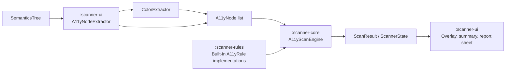

# Compose A11y Scanner

[](https://github.com/mohdaquib/ComposeA11yScanner/actions/workflows/ci.yml)
[](https://github.com/mohdaquib/ComposeA11yScanner/actions/workflows/docs.yml)
[](https://jitpack.io/#mohdaquib/ComposeA11yScanner)

Runtime accessibility scanner that overlays issues directly on your Compose UI


## Architecture



`:scanner-core` owns the scan engine, models, result state, and `A11yRule` contract. `:scanner-rules` contains the built-in rules. `:scanner-ui` reads the Compose semantics tree, samples colors through `ColorExtractor`, runs scans, and draws issue overlays on top of the host UI.

## Installation

```kotlin
repositories { maven("https://jitpack.io") }
dependencies { debugImplementation("com.github.mohdaquib.ComposeA11yScanner:scanner-ui:v1.0.0") }
```

Use a debug-only dependency because the scanner is intended for development builds. `:scanner-ui` brings `:scanner-core` and `:scanner-rules` transitively.

## Integration

### A11yScannerScaffold

Wrap the screen you want to inspect with `A11yScannerScaffold`. Provide an `A11yScannerController` that can extract nodes from your current Compose semantics tree.

```kotlin
@Composable
fun DebugScannerScreen(
    scannerController: A11yScannerController,
    content: @Composable () -> Unit,
) {
    val config = remember {
        ScannerConfig(
            enabledRules = ScannerRules.allRuleIds().toSet(),
            autoScan = false,
        )
    }

    A11yScannerScaffold(
        scannerController = scannerController,
        config = config,
        modifier = Modifier.fillMaxSize(),
    ) {
        content()
    }
}
```

The scaffold renders your content first, then draws issue highlight boxes, the scan summary bar, and the issue detail sheet above it.

### Shake To Scan

Call `scanOnShake()` from a composable that is active while the scanned screen is visible.

```kotlin
scanOnShake(
    enabled = true,
    onScanRequested = {
        scannerController.startScan()
    },
)
```

### Manual Trigger

Wire a debug menu item, toolbar button, or test-only action directly to the controller.

```kotlin
IconButton(onClick = { scannerController.startScan() }) {
    Icon(
        imageVector = Icons.Default.Search,
        contentDescription = "Scan accessibility",
    )
}
```

If you use the top-level activity overlay API, call `ComposeA11yScanner.triggerScan()` instead.

```kotlin
ComposeA11yScanner.triggerScan()
```

## Built-In Rules

See [RULES.md](RULES.md) for complete behavior, fixes, WCAG references, and examples.

| Rule ID | Name | Severity | Details |
| --- | --- | --- | --- |
| `touch-target-overlap` | Touch Target Overlap | Warning | [RULES.md](RULES.md#touch-target-overlap---touch-target-overlap) |
| `missing-content-description` | Missing Content Description | Error | [RULES.md](RULES.md#missing-content-description---missing-content-description) |
| `duplicate-content-description` | Duplicate Content Description | Warning | [RULES.md](RULES.md#duplicate-content-description---duplicate-content-description) |
| `focus-order` | Focus Order | Error | [RULES.md](RULES.md#focus-order---focus-order) |
| `text-scaling` | Text Scaling | Warning | [RULES.md](RULES.md#text-scaling---text-scaling) |
| `image-text-overlay` | Image With Text Overlay | Warning | [RULES.md](RULES.md#image-text-overlay---image-with-text-overlay) |
| `clickable-role` | Clickable Role | Error | [RULES.md](RULES.md#clickable-role---clickable-role) |

## Custom Rules

Create a rule by implementing `A11yRule`. Use a stable `ruleId`, assign a severity, and return an `A11yIssue` only when the node fails your check.

```kotlin
class MissingTestTagRule : A11yRule {
    override val ruleId = "missing-test-tag"
    override val ruleName = "Missing Test Tag"
    override val severity = A11ySeverity.Warning
    override val wcagReference: String? = null

    override fun evaluate(node: A11yNode): A11yIssue? {
        if (!node.isTouchTarget || node.isMergedDescendant) return null
        if (node.composableName.contains("TestTag", ignoreCase = true)) return null

        return A11yIssue(
            issueId = "${ruleId}_${node.nodeId}",
            severity = severity,
            ruleId = ruleId,
            ruleName = ruleName,
            affectedNode = node,
            message = "Interactive node does not expose a stable test tag.",
            howToFix = "Add Modifier.testTag() to make this control easier to identify in tests.",
            wcagReference = wcagReference,
        )
    }
}
```

Register custom rules on the controller:

```kotlin
val scannerController = A11yScannerController(
    nodeProvider = { extractNodesFromCurrentSemanticsTree() },
    screenDensity = density,
).withRules(MissingTestTagRule())
```

Custom rule IDs are automatically enabled by `A11yScannerController.withRules(...)` before each scan.
