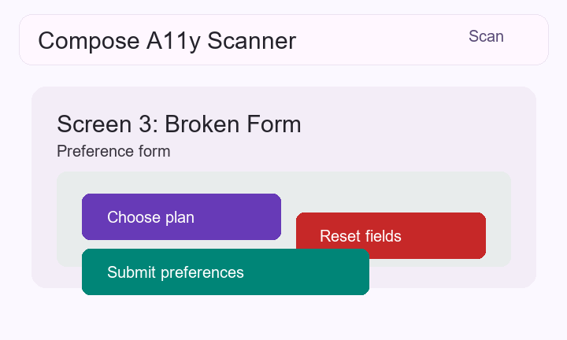
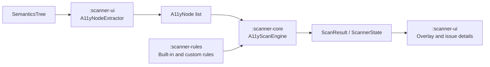

# Compose A11y Scanner

[](https://androidweekly.net/issues/issue-736/#:~:text=Compose%20A11y%20Scanner,touch%20target%20issues.)
[](https://jetc.dev/#:~:text=GitHub%3A%20mohdaquib%20/%20ComposeA11yScanner,content%20descriptions%2C%20etc.)
[](LICENSE)
[](https://github.com/mohdaquib/ComposeA11yScanner/actions/workflows/ci.yml)
[](https://github.com/mohdaquib/ComposeA11yScanner/actions/workflows/docs.yml)
[](https://jitpack.io/#mohdaquib/ComposeA11yScanner)

Runtime accessibility scanner that overlays issues directly on your Compose UI



## 🏆 Featured

ComposeA11yScanner was featured in  **Jetpack Compose Newsletter** and **Android Weekly** 🎉

[

[](https://androidweekly.net/issues/issue-736/#:~:text=Compose%20A11y%20Scanner,touch%20target%20issues.)

## Quick start

Add JitPack and the debug-only scanner dependency:

```kotlin
// settings.gradle.kts
dependencyResolutionManagement {
    repositories {
        google()
        mavenCentral()
        maven("https://jitpack.io")
    }
}

// app/build.gradle.kts
dependencies {
    debugImplementation("com.github.mohdaquib.ComposeA11yScanner:scanner-ui:2.1.0")
}
```

That is all the integration required. AndroidX Startup automatically attaches the overlay and runs an initial scan for each `ComponentActivity` in a debuggable app. Release builds do not package the scanner when it is added with `debugImplementation`.

To request another scan, call the API from a debug source set (for example, `src/debug/java/.../ScannerActions.kt`):

```kotlin
import com.composea11yscanner.ComposeA11yScanner

ComposeA11yScanner.triggerScan()
```

`ComposeA11yScanner.scan()` is safe to collect before the first activity reaches `onResume` when
automatic installation is enabled. The flow waits for an installed activity scanner and then
forwards its state.

For shake-to-scan, add one call to a debug-only composable that is active while the screen is visible:

```kotlin
import com.composea11yscanner.triggers.scanOnShake

@Composable
fun App() {
    scanOnShake()
    AppContent()
}
```

The scanner enables all built-in rules by default. The overlay is removed automatically when its activity is destroyed. Keep direct scanner imports in `src/debug`; a `debugImplementation` dependency is intentionally unavailable while compiling release sources.

## Configuration

Optional manifest metadata configures the auto-installed scanner:

```xml
<application>
    <meta-data
        android:name="a11y_scanner_min_contrast"
        android:value="4.5" />
    <meta-data
        android:name="a11y_scanner_auto_scan"
        android:value="false" />
</application>
```

### Manual installation

Use manual installation only when you need a programmatic `ScannerConfig`. First disable the automatic initializer in the app manifest:

```xml
<manifest xmlns:tools="http://schemas.android.com/tools">
    <application>
        <provider
            android:name="androidx.startup.InitializationProvider"
            android:authorities="${applicationId}.androidx-startup"
            tools:node="merge">
            <meta-data
                android:name="com.composea11yscanner.A11yScannerInitializer"
                tools:node="remove" />
        </provider>
    </application>
</manifest>
```

Then install after `setContent`:

```kotlin
setContent { App() }

ComposeA11yScanner.install(
    activity = this,
    config = ScannerConfig(
        enabledRules = ScannerRules.allRuleIds().toSet(),
        minContrastRatio = 4.5f,
        autoScan = false,
    ),
)
```

Do not combine automatic and manual installation. Repeated installation on the same activity is ignored, but keeping one ownership path makes configuration predictable.

For Navigation Compose, provide the current route when installing manually. An explicit key reliably
invalidates stale results even when two destinations have the same semantics structure:

```kotlin
ComposeA11yScanner.install(
    activity = this,
    destinationKeyProvider = {
        navController.currentBackStackEntry?.destination?.route
    },
)
```

If a navigation framework cannot expose a route provider, automatic host/semantics detection remains
enabled. A custom navigator can also invalidate the current result explicitly:

```kotlin
ComposeA11yScanner.notifyScreenChanged()
```

### Embedded scaffold

`A11yScannerScaffold` is the advanced API for apps that want the scanner UI inside their own Compose hierarchy or need a custom node provider. It requires an `A11yScannerController`; most integrations should use the automatic activity overlay above.

```kotlin
A11yScannerScaffold(
    scannerController = scannerController,
    config = config,
    modifier = Modifier.fillMaxSize(),
) {
    AppContent()
}
```

## Built-In Rules

See [RULES.md](RULES.md) for complete behavior, fixes, WCAG references, and examples.

| Rule ID | Name | Severity | Details |
| --- | --- | --- | --- |
| `touch-target-overlap` | Touch Target Overlap | Warning | [RULES.md](RULES.md#touch-target-overlap---touch-target-overlap) |
| `missing-content-description` | Missing Content Description | Error | [RULES.md](RULES.md#missing-content-description---missing-content-description) |
| `duplicate-content-description` | Duplicate Content Description | Warning | [RULES.md](RULES.md#duplicate-content-description---duplicate-content-description) |
| `focus-order` | Focus Order | Error | [RULES.md](RULES.md#focus-order---focus-order) |
| `text-scaling` | Text Scaling | Warning | [RULES.md](RULES.md#text-scaling---text-scaling) |
| `image-text-overlay` | Image With Text Overlay | Warning | [RULES.md](RULES.md#image-text-overlay---image-with-text-overlay) |
| `clickable-role` | Clickable Role | Error | [RULES.md](RULES.md#clickable-role---clickable-role) |
| `text-contrast` | Text Contrast | Warning | [RULES.md](RULES.md#text-contrast---text-contrast) |

## Custom Rules

Create a rule by implementing `A11yRule`. Use a stable `ruleId`, assign a severity, and return an `A11yIssue` only when the node fails your check.

```kotlin
class MissingTestTagRule : A11yRule {
    override val ruleId = "missing-test-tag"
    override val ruleName = "Missing Test Tag"
    override val severity = A11ySeverity.Warning
    override val wcagReference: String? = null

    override fun evaluate(node: A11yNode): A11yIssue? {
        if (!node.isTouchTarget || node.isMergedDescendant) return null
        if (node.composableName.contains("TestTag", ignoreCase = true)) return null

        return A11yIssue(
            issueId = "${ruleId}_${node.nodeId}",
            severity = severity,
            ruleId = ruleId,
            ruleName = ruleName,
            affectedNode = node,
            message = "Interactive node does not expose a stable test tag.",
            howToFix = "Add Modifier.testTag() to make this control easier to identify in tests.",
            wcagReference = wcagReference,
        )
    }
}
```

Register custom rules on the controller:

```kotlin
val scannerController = A11yScannerController(
    nodeProvider = { extractNodesFromCurrentSemanticsTree() },
    screenDensity = density,
).withRules(MissingTestTagRule())
```

Custom rule IDs are automatically enabled by `A11yScannerController.withRules(...)` before each scan.

## Architecture



`:scanner-core` owns the scan engine and public models. `:scanner-rules` contains built-in rules. `:scanner-ui` handles Android/Compose integration, node extraction, triggers, and the overlay.


