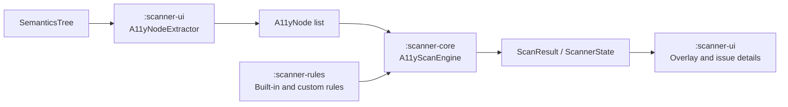

# ComposeA11yScanner

Catch accessibility issues while building Jetpack Compose UIs - including rendered text-contrast
problems that are not available from the Compose semantics tree alone.

[](https://androidweekly.net/issues/issue-736/#:~:text=Compose%20A11y%20Scanner,touch%20target%20issues.)
[](https://jetc.dev/#:~:text=GitHub%3A%20mohdaquib%20/%20ComposeA11yScanner,content%20descriptions%2C%20etc.)
[](LICENSE)
[](https://github.com/mohdaquib/ComposeA11yScanner/actions/workflows/ci.yml)
[](https://mohdaquib.github.io/ComposeA11yScanner/)
[](https://jitpack.io/#mohdaquib/ComposeA11yScanner)

ComposeA11yScanner is a debug-first runtime scanner that finds accessibility issues in Jetpack
Compose and highlights them directly on the rendered UI. Non-debuggable builds are denied by
default and can opt in explicitly for trusted internal use.


## Why ComposeA11yScanner?

- **Immediate visual feedback** - issues are outlined where they occur on the screen.
- **Semantics and rendered analysis** - rules inspect Compose semantics, while text contrast is
  estimated from a captured Compose host.
- **Actionable guidance** - every finding includes its severity, WCAG reference, and a suggested fix.
- **Minimal setup** - AndroidX Startup handles activity tracking and installation.
- **Default-deny integration** - debug builds work automatically; trusted builds must opt in.
- **Extensible rules** - use the bundled rules or add checks for your own accessibility standards.

## What's new in 2.1.0

- Added `TextContrastRule` with conservative screenshot-based foreground and background analysis.
- Improved scanning across Fragment navigation and Compose destination changes.
- Improved Compose host selection, screen-readiness detection, and stale-result invalidation.
- Reduced false positives and false negatives involving merged semantics, lazy layouts, off-screen
  nodes, repeated descriptions, rich text, and overlapping touch targets.
- Preserved source compatibility with 2.0.0; no public API was removed.

Because rendered text contrast is now checked by default, 2.1.0 may report valid warnings that
earlier versions could not detect.

[Read the 2.1.0 release notes](https://github.com/mohdaquib/ComposeA11yScanner/releases/tag/2.1.0)
or view the [full changelog](https://github.com/mohdaquib/ComposeA11yScanner/compare/v2.0.0...2.1.0).

## Contents

- [What's new in 2.1.0](#whats-new-in-210)
- [Quick start](#quick-start)
- [Configuration](#configuration)
- [Built-in rules](#built-in-rules)
- [Text contrast and known limitations](#text-contrast-and-known-limitations)
- [Custom rules](#custom-rules)
- [Architecture](#architecture)
- [Support and contributions](#support-and-contributions)
- [Featured in](#featured-in)

## Quick start

### 1. Add the dependency

ComposeA11yScanner supports Android API 24 and newer. Add JitPack to dependency resolution and
add the scanner to the debug variant only:

```kotlin
// settings.gradle.kts
dependencyResolutionManagement {
    repositories {
        google()
        mavenCentral()
        maven("https://jitpack.io")
    }
}

// app/build.gradle.kts
dependencies {
    debugImplementation("com.github.mohdaquib.ComposeA11yScanner:scanner-ui:2.1.0")
}
```

That is all the integration required. AndroidX Startup attaches the overlay and runs an initial
scan for every `ComponentActivity` in a debuggable app.

> [!IMPORTANT]
> `debugImplementation` remains the recommended setup and keeps scanner code out of release builds.

### Trusted non-debuggable builds

Use `implementation` only when a trusted internal build must run the scanner without being
Android-debuggable:

```kotlin
dependencies {
    implementation("com.github.mohdaquib.ComposeA11yScanner:scanner-ui:<version>")
}
```

Enable or disable it from the main thread whenever the environment changes:

```kotlin
ComposeA11yScanner.toggleScanner(enabled = endpoint == DEV || endpoint == TEST)
```

Use a positive allowlist and prefer an internal flavor/source set when available. AndroidX Startup
must remain enabled. Calling `toggleScanner(true)` before an activity resumes
installs on resume; calling it afterward installs immediately on every resumed activity. Calling
`toggleScanner(false)` removes non-debuggable overlays, while debuggable builds remain enabled.

If AndroidX Startup is removed for manual installation, `toggleScanner(true)` only grants
permission; the app must still call `install()` for each activity.

### 2. Trigger a scan

For debug-only integration, call the API from `src/debug`. For trusted non-debuggable builds,
place the trigger in `src/main` or the trusted variant's source set:

```kotlin
import com.composea11yscanner.ComposeA11yScanner

ComposeA11yScanner.triggerScan()
```

Trusted builds must invoke direct triggers only while the same `scannerEnabled` value passed to
`toggleScanner()` is true:

```kotlin
if (scannerEnabled) ComposeA11yScanner.triggerScan()
```

`ComposeA11yScanner.scan()` is safe to collect before the first activity reaches `onResume` when
automatic installation is enabled. The flow waits for an installed activity scanner, then forwards
its state.

### Optional: shake to scan

Add `scanOnShake()` to a composable compiled into the enabled variant: `src/debug` for debug-only
integration, or `src/main`/the trusted source set for non-debuggable integration:

```kotlin
import com.composea11yscanner.triggers.scanOnShake

@Composable
fun App() {
    scanOnShake(enabled = scannerEnabled)
    AppContent()
}
```

For trusted builds, derive `scannerEnabled` from the same condition passed to `toggleScanner()` so
triggers stop before production permission is disabled.

All built-in rules are enabled by default, and the overlay is removed when its activity is destroyed.
For debug-only integration, keep direct scanner imports in `src/debug`; dependencies added with
`debugImplementation` are intentionally unavailable to release source sets.

## Configuration

Optional manifest metadata controls the auto-installed scanner:

```xml
<application>
    <meta-data
        android:name="a11y_scanner_min_contrast"
        android:value="4.5" />
    <meta-data
        android:name="a11y_scanner_auto_scan"
        android:value="false" />
</application>
```

### Manual installation

Use manual installation only when you need a programmatic `ScannerConfig`. First disable the automatic initializer in the app manifest:

```xml
<manifest xmlns:tools="http://schemas.android.com/tools">
    <application>
        <provider
            android:name="androidx.startup.InitializationProvider"
            android:authorities="${applicationId}.androidx-startup"
            tools:node="merge">
            <meta-data
                android:name="com.composea11yscanner.A11yScannerInitializer"
                tools:node="remove" />
        </provider>
    </application>
</manifest>
```

Then install after `setContent`:

```kotlin
setContent { App() }

ComposeA11yScanner.install(
    activity = this,
    config = ScannerConfig(
        enabledRules = ScannerRules.allRuleIds().toSet(),
        minContrastRatio = 4.5f,
        autoScan = false,
    ),
)
```

Do not combine automatic and manual installation. Repeated installation on the same activity is
ignored, but keeping one ownership path makes configuration predictable. With multiple manual
activities, global APIs target the latest surviving installation and fall back after removal.

For Navigation Compose, provide the current route when installing manually. An explicit key reliably
invalidates stale results even when two destinations have the same semantics structure:

```kotlin
ComposeA11yScanner.install(
    activity = this,
    destinationKeyProvider = {
        navController.currentBackStackEntry?.destination?.route
    },
)
```

If a navigation framework cannot expose a route provider, automatic host/semantics detection remains
enabled. A custom navigator can also invalidate the current result explicitly:

```kotlin
ComposeA11yScanner.notifyScreenChanged()
```

### Embedded scaffold

`A11yScannerScaffold` is the advanced API for apps that want the scanner UI inside their own Compose hierarchy or need a custom node provider. It requires an `A11yScannerController`; most integrations should use the automatic activity overlay above.

```kotlin
A11yScannerScaffold(
    scannerController = scannerController,
    config = config,
    modifier = Modifier.fillMaxSize(),
) {
    AppContent()
}
```

## Built-in rules

See [RULES.md](RULES.md) for complete behavior, fixes, WCAG references, and examples.

| Rule | Severity | Detects |
| --- | --- | --- |
| [Touch Target Overlap](RULES.md#touch-target-overlap---touch-target-overlap) | Warning | Interactive elements whose effective touch and visual bounds overlap. |
| [Missing Content Description](RULES.md#missing-content-description---missing-content-description) | Error | Interactive or image-like elements without a readable label. |
| [Duplicate Content Description](RULES.md#duplicate-content-description---duplicate-content-description) | Warning | Distinct controls in the same logical scope that expose the same description. |
| [Focus Order](RULES.md#focus-order---focus-order) | Error | Focus traversal that conflicts with the expected visual reading order. |
| [Text Scaling](RULES.md#text-scaling---text-scaling) | Warning | Text likely to clip or overflow when the user increases font size. |
| [Image With Text Overlay](RULES.md#image-text-overlay---image-with-text-overlay) | Warning | Text overlapping an image, where dynamic content can create contrast risk. |
| [Clickable Role](RULES.md#clickable-role---clickable-role) | Error | Clickable elements without an appropriate semantic role or label. |
| [Text Contrast](RULES.md#text-contrast---text-contrast) | Warning | Confidently measured rendered text below the configured contrast ratio. |

## Text contrast and known limitations

`TextContrastRule` complements semantics-based checks with rendered-pixel analysis. The scanner
captures the selected Compose host once, samples enabled semantic `Text` nodes, and applies the WCAG
relative-luminance formula when it can confidently identify a foreground and a solid-looking
background. The default minimum ratio is 4.5:1 and can be changed through `ScannerConfig` or manifest
metadata.

The estimator intentionally skips uncertain results instead of guessing. Keep these boundaries in
mind when interpreting a scan:

- Photos, gradients, textured surfaces, and other visually ambiguous text backgrounds may be skipped.
- Text drawn on a `Canvas`, embedded in an image, or otherwise absent from Compose semantics is not
  discovered through OCR.
- One configurable ratio is applied to measured text; separate large-text thresholds are not inferred.
- A scan represents the currently rendered theme, state, content, and destination. Scan every state
  that users can encounter.
- Automated findings complement, but do not replace, testing with TalkBack, font scaling, keyboard or
  switch access, and human accessibility review.

If a result appears incorrect, include the affected screen, scanner version, exported scan result,
and a minimal reproduction when opening an issue.

## Custom rules

Create a rule by implementing `A11yRule`. Use a stable `ruleId`, assign a severity, and return an `A11yIssue` only when the node fails your check.

```kotlin
class MissingTestTagRule : A11yRule {
    override val ruleId = "missing-test-tag"
    override val ruleName = "Missing Test Tag"
    override val severity = A11ySeverity.Warning
    override val wcagReference: String? = null

    override fun evaluate(node: A11yNode): A11yIssue? {
        if (!node.isTouchTarget || node.isMergedDescendant) return null
        if (node.composableName.contains("TestTag", ignoreCase = true)) return null

        return A11yIssue(
            issueId = "${ruleId}_${node.nodeId}",
            severity = severity,
            ruleId = ruleId,
            ruleName = ruleName,
            affectedNode = node,
            message = "Interactive node does not expose a stable test tag.",
            howToFix = "Add Modifier.testTag() to make this control easier to identify in tests.",
            wcagReference = wcagReference,
        )
    }
}
```

Register custom rules on the controller:

```kotlin
val scannerController = A11yScannerController(
    nodeProvider = { extractNodesFromCurrentSemanticsTree() },
    screenDensity = density,
).withRules(MissingTestTagRule())
```

Custom rule IDs are automatically enabled by `A11yScannerController.withRules(...)` before each scan.

## Architecture



`:scanner-core` owns the scan engine and public models. `:scanner-rules` contains built-in rules. `:scanner-ui` handles Android/Compose integration, node extraction, triggers, and the overlay.

## Support and contributions

Questions, bug reports, rule proposals, and pull requests are welcome. Use
[GitHub Issues](https://github.com/mohdaquib/ComposeA11yScanner/issues) and choose a title that
identifies whether the report is a false positive, false negative, integration problem, or feature
request.

For scanner-result problems, please include:

- ComposeA11yScanner version and Android version.
- Navigation and hosting setup, such as Navigation Compose, Fragments, or nested `ComposeView`s.
- A screenshot and exported scan-result JSON with sensitive information removed.
- Expected behavior, actual behavior, and reproduction steps.

See the [sample app](sample) for broken and corrected examples of the bundled rules, and browse the
[API documentation](https://mohdaquib.github.io/ComposeA11yScanner/) for public types and functions.

## Featured in

ComposeA11yScanner has been featured in the
[Jetpack Compose Newsletter](https://jetc.dev/#:~:text=GitHub%3A%20mohdaquib%20%2F%20ComposeA11yScanner,content%20descriptions%2C%20etc.)
and [Android Weekly](https://androidweekly.net/issues/issue-736/#:~:text=Compose%20A11y%20Scanner,touch%20target%20issues.).

## License

ComposeA11yScanner is available under the [Apache License 2.0](LICENSE).

